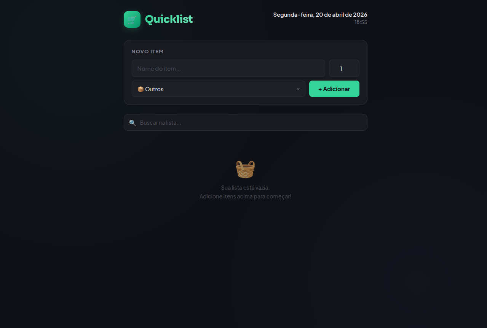

# 🛒 Quicklist — Lista de Compras da Semana

<p align="center">
  
  
  
</p>

<p align="center">
  
</p>

Aplicação web para gerenciar a lista de compras da semana de forma prática e organizada. O usuário pode adicionar novos itens com categoria e quantidade, marcar como concluídos e removê-los da lista — tudo com interface responsiva, tema escuro e feedback visual em cada ação.

Projeto desenvolvido como desafio do **módulo de JavaScript** da [Rocketseat](https://app.rocketseat.com.br/), dentro do programa de residência em parceria com a **UNICAP**.

---

## ✨ Funcionalidades

- **Data e hora em tempo real** exibidas no cabeçalho, atualizadas automaticamente
- **Adicionar itens** com nome, quantidade e categoria (Enter ou botão)
- **Categorias com tags coloridas**: Frutas, Carnes, Padaria, Bebidas, Limpeza e Outros
- **Seções separadas** para itens **Pendentes** e **Concluídos**, com contadores independentes
- **Barra de progresso** mostrando a porcentagem de itens já comprados
- **Busca em tempo real** para filtrar itens pelo nome
- **Marcar/desmarcar** itens como comprados via checkbox customizado
- **Excluir itens** com animação de saída (slide + fade)
- **Limpar todos os concluídos** de uma só vez
- **Notificação toast** como feedback visual ao adicionar ou remover
- **Persistência com localStorage** — a lista é mantida entre sessões
- **Proteção contra XSS** ao exibir texto do usuário

---

## 📱 Responsividade

A interface se adapta a qualquer tamanho de tela:

| Desktop | Mobile |
|---------|--------|
| Formulário em grid (input + quantidade lado a lado) | Formulário empilhado verticalmente |
| Tags e quantidade na mesma linha do item | Tags reorganizadas abaixo do nome |
| Layout otimizado para telas largas | Touch-friendly com botões maiores |

---

## 🛠️ Tecnologias e Conceitos

- **HTML5** — estrutura semântica
- **CSS3** — variáveis CSS, Flexbox, Grid, animações com `@keyframes`, media queries, tema dark com gradientes
- **JavaScript (ES6+)** — manipulação do DOM, eventos, `localStorage`, `Date`, `Array methods` (`filter`, `find`, `map`, `unshift`), template literals, arrow functions

---

## 📂 Estrutura

```
quicklist/
├── index.html   # Aplicação completa (HTML + CSS + JS)
└── README.md    # Documentação do projeto
```

O projeto é um **single-file application** — todo o código está em um único arquivo HTML com CSS e JavaScript embutidos, totalmente comentado em português para facilitar a leitura.

---

## 🚀 Como Executar

1. Clone o repositório:
   ```bash
   git clone https://github.com/seu-usuario/quicklist.git
   ```

2. Abra o arquivo `index.html` no navegador — não precisa de servidor, instalação ou dependências.

---

## 📝 Aprendizados

- Manipulação do **DOM** com `getElementById`, `innerHTML`, `classList`
- **Eventos** do navegador: `onclick`, `onchange`, `keypress`, `oninput`
- **Arrays**: `filter`, `find`, `map`, `unshift` para gerenciar estado
- **localStorage** para persistência de dados client-side
- **Template literals** para construção dinâmica de HTML
- **CSS Variables** para manter consistência no tema
- **Animações CSS** com `@keyframes` e `transition`
- **Responsividade** com media queries e layout adaptativo
- **Segurança**: sanitização de input contra XSS

---

## 👩‍💻 Autora

**Vanessa Lima**

Desenvolvido durante o programa de residência **UNICAP** × [Rocketseat](https://app.rocketseat.com.br/) — Módulo JavaScript.

---

<p align="center">
  Feito com 💚
</p>
